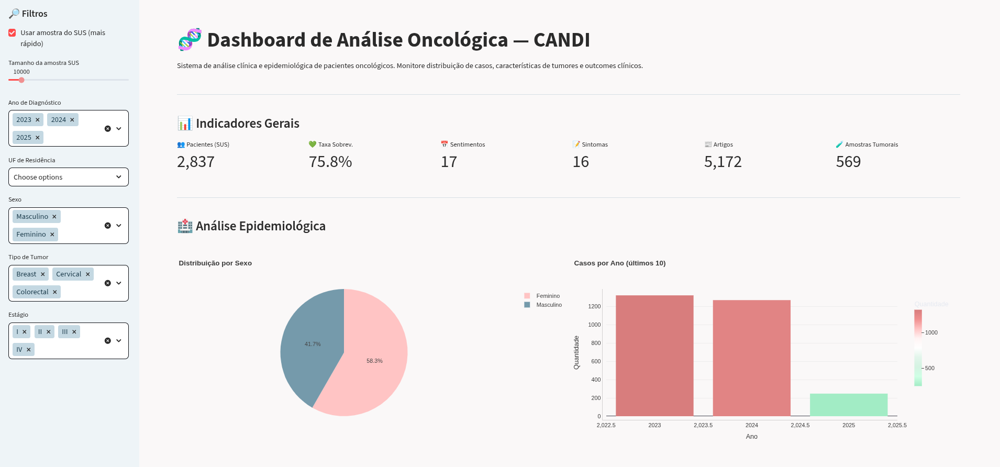

<div align="center">

# Business Intelligence e Big Data

Repositório de exercícios e projetos da disciplina de **Business Intelligence & Big Data** — Grupo 1 "Candi" · Fatec São Caetano do Sul · 2026

</div>

---

## 👥 Grupo 1 — Candi

Projeto desenvolvido para a disciplina **BDN007 — Business Intelligence e Big Data**  
Fatec São Caetano do Sul · 2026

- Carolina Pichelli Souza
- Fernando Alcantara D'Avila
- Guilherme Xavier Zanetti
- Heloísa Pichelli Souza
- Lucas Batista de Sousa
- Nuno Kasuo Tronco Yokoji

---

## 📁 Estrutura do Repositório

```
Dashboard-BDN007-2026/
├── cancerPatientData-dashboard/   # Dashboard clínico individual (dataset único)
│
└── crossData-dashboard/           # Dashboard de análise cruzada (Dashboard principal)
    ├── dados-candi-API/           # Código fonte da Lambda que fornece dados sobre o app Candi
    │
    ├── testes-dados/              # Notebook Jupyter para análise de datasets
    │
    ├── main.py                    # Aplicação Streamlit principal
    ├── load_datasets.py           # Módulo de carregamento lazy dos datasets
    ├── load_kaggle.py             # Módulo de download automático via Kaggle API
    ├── .env.example               # Variáveis de ambiente necessárias (sem valores)
    └── requirements.txt           # Dependências do projeto
```

---

## 📊 Dashboard Principal

### `crossData-dashboard` — Dashboard de Análise Cruzada

Dashboard de análise integrada que cruza **8 fontes de dados** distintas sobre oncologia, incluindo dados reais do projeto CANDI, datasets do Kaggle e dados abertos do SUS.

<p align="center">
  
</p>

#### 📂 `dados-candi-API`

Diretório contendo o código da AWS Lambda que expõe os dados do projeto CANDI — registros de sentimentos (`CANDIFeelings`) e sintomas (`CANDISymptoms`) dos pacientes, consumidos diretamente via HTTP pelo dashboard.

**Datasets utilizados:**

| Arquivo local | Origem | Descrição |
|---|---|---|
| `dataSeria.csv` | Kaggle — `erdemtaha/cancer-data` | Dataset Wisconsin — características físicas de tumores |
| `datasetSUS.csv` | Kaggle — `lhucastenorio/oncology-treatment-datasus-brazil-20132023` | Dados de pacientes oncológicos no SUS (dataset grande, tratado com Dask) |
| `noticiasCancer.csv` | Kaggle — `oliveiraexp/oncology-news-and-research-december-2025` | Artigos científicos e jornalísticos sobre câncer |
| `sentimentosOncologia.csv` | Kaggle — `orvile/sentiments-in-oncology` | Comentários de pacientes oncológicos com análise de sentimento |
| `sobrevivenciaCancer.csv` | Kaggle — `sakshihulke/oncology-treatment-and-survival-analysis-dataset` | Taxas de sobrevivência por tipo de tumor e estágio |
| `tempoP_inicioTratamento.csv` | Kaggle — `rafaelasantosm/painel-oncologiabr` | Tempo até início do tratamento por região brasileira |
| `candiSentimentos` | AWS DynamoDB via Lambda | Sentimentos registrados por pacientes no app CANDI |
| `candiSintomas` | AWS DynamoDB via Lambda | Sintomas registrados por pacientes no app CANDI |

**Principais funcionalidades:**
- Análise epidemiológica do SUS (distribuição por sexo, ano, UF)
- Taxa de sobrevivência por tipo de tumor e estágio
- Correlação entre características tumorais (heatmap)
- Sentimentos e sintomas do CANDI (linha do tempo + top sintomas)
- **Análise cruzada:** distribuição etária CANDI vs Sobrevivência, severidade Wisconsin vs Sobrevivência, felicidade CANDI vs estágios
- Tempo para início do tratamento por região

**Stack:** Python · Streamlit · Plotly · Pandas · Dask · NumPy · AWS Lambda · AWS DynamoDB · Kaggle API

---

## ⚙️ Como rodar localmente

### 1. Clone o repositório

```bash
git clone https://github.com/zanettIno/Dashboard-BDN007-2026
cd Dashboard-BDN007-2026/crossData-dashboard/
```

### 2. Instale as dependências

```bash
pip install -r requirements.txt
```

### 3. Configure as variáveis de ambiente

Copie o arquivo de exemplo e preencha com suas credenciais:

```bash
cp .env.example .env
```

```env
KAGGLE_USERNAME=seu_username_kaggle
KAGGLE_KEY=sua_api_key_kaggle
```

> As credenciais do Kaggle estão disponíveis em kaggle.com → Account → API → Create New Token.  
> O `.env` está no `.gitignore` e **nunca deve ser commitado**.

### 4. Execute

```bash
streamlit run main.py
```

Os datasets do Kaggle são **baixados automaticamente** na primeira execução e ficam em cache local. Não é necessário baixar nenhum CSV manualmente.

> ⚠️ O `datasetSUS.csv` é grande. O dashboard usa processamento lazy com Dask e oferece modo de amostragem para melhor performance.

---

## ⚙️ Requisitos Gerais

- Python 3.10+
- Conta no [Kaggle](https://kaggle.com) com API token gerado

<div align="center">
    Nas trincheiras pelo senhor Professor Leandro de Ágil e BI :)
</div>
